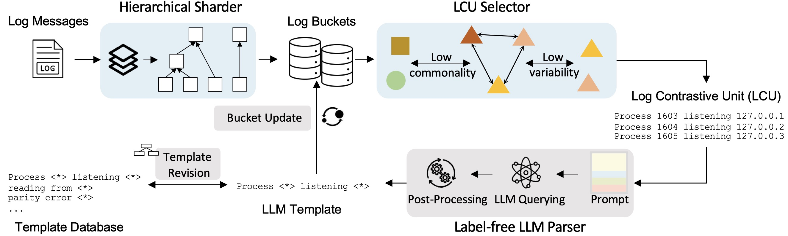

# LUNAR: LLM-based Unsupervised Log Parsing

This is the official repo for our FSE 2025 accepted paper: _**No More Labelled Examples? An Unsupervised Log Parser with LLMs**_





# 1. Quick Start
### Step 1: Clone the repo
```bash
git clone git@github.com:Jun-jie-Huang/LUNAR.git
```
### Step 2: Environment
Run the following command to install the dependencies
```bash
conda create -n lunar python=3.8.19
conda activate lunar

cd LUNAR
pip install -r requirements.txt
```

### Step 3: Add openai API key and base url
Add your openai API key and base url by updating line 195 in `./LUNAR/config.py` file
```python
LLM_BASE_MAPPING = {
    "gpt35": ["gpt-3.5-turbo-0125", "API_BASE_URL", "API_KEY"],
}
```

### Step 4: Run with example Apache dataset
```commandline
bash run_lunar.sh Apache
```

# 2. Run with more datasets
In this repo, we provide the Apache dataset as an example due to the github file size limitation. To experiment with more datasets, please follow the below steps.

### Step 1: Download Loghub-2.0
You can download the other datasets in LogHub2.0 from this [link](https://zenodo.org/records/8275861) and move them to `./dataset` just like the Apache dataset.


### Step 2: Run with all datasets
The industrial parsing datasets, including, `CTS`, `HiBench`, and `LoFI`, can be found in `./dataset`. 

You can run the following command to evaluate on all datasets
```commandline
bash run_lunar.sh all
```


# 3. LUNAR-Parallel
You can also run an efficient version LUNAR-Parallel with the following steps:

##### Step 1: Add openai API key and base url
Add your openai API key and base url by updating line 18-19 in `main_parallel.py` file
```python
API_KEY = "sk-API_KEY"
BASE_URL = "API_BASE_URL"
```

##### Step 2: Run with example Apache dataset
```commandline
bash run_lunar_parallel.sh Apache
```

##### Step 2: Run with Loghub-2.0
After you download the Loghub-2.0 datasets, you can use the following scripts to evaluate on all datasets
```commandline
bash run_lunar_parallel.sh all
```

# 4. LoFI dataset
In our paper, we annotate a new log parsing dataset with industrial logs LoFI. The original logs are collected from our ISSRE-2024 paper [Demystifying and Extracting Fault-indicating Information from Logs for Failure Diagnosis](https://arxiv.org/pdf/2409.13561).
You can find our dataset at [`./dataset/LoFI`](https://github.com/Jun-jie-Huang/LUNAR/blob/main/LUNAR/dataset/LoFI).


## Citation
If you find our work useful, please consider citing our paper:

```
@article{huang2024lunar,
  title={LUNAR: Unsupervised LLM-based Log Parsing},
  author={Huang, Junjie and Jiang, Zhihan and Chen, Zhuangbin and Lyu, Michael R},
  journal={arXiv preprint arXiv:2406.07174},
  year={2024}
}

@inproceedings{huang2024demystifying,
  title={Demystifying and Extracting Fault-indicating Information from Logs for Failure Diagnosis},
  author={Huang, Junjie and Jiang, Zhihan and Liu, Jinyang and Huo, Yintong and Gu, Jiazhen and Chen, Zhuangbin and Feng, Cong and Dong, Hui and Yang, Zengyin and Lyu, Michael R},
  booktitle={2024 IEEE 35th International Symposium on Software Reliability Engineering (ISSRE)},
  pages={511--522},
  year={2024},
  organization={IEEE}
}
```
